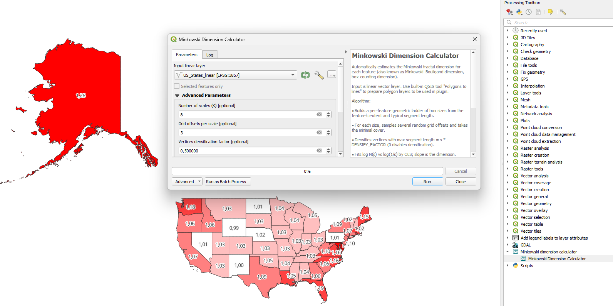

# Minkowski Dimension Calculator
A QGIS plugin that calculates Minkowski dimension (also known as Minkowski–Bouligand dimension, box-counting dimension) for features of vector layer.

## Documentation

General plugin documentation is available here: https://ekazakov.me/minkowski-dimension-calculator-qgis-plugin

## Installation

The plugin is available in the official QGIS Plugin Repository.

You can also install it from ZIP archive.

## Contacts

Eduard Kazakov | ee.kazakov@gmail.com